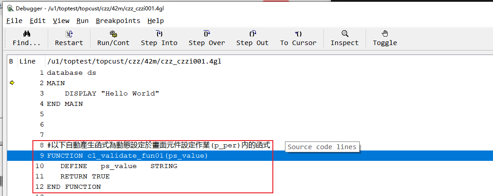
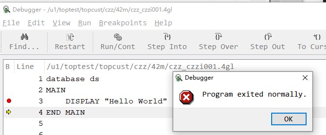

# 调试排错-查看代码如何一步步执行

程序员的主要工作之一是编写代码。
代码从无到有，需要诸葛字符输入，工作量显然比较大。
但实际上，编码容易调试难。
代码编写完毕后，程序员将会法非大量时间进行错误或者问题的排查、修改。
在电脑系统程序中，将隐藏着的一些未发现的缺陷、问题或者错误，成为`bug`。

## debug--由来

马克2号（Harvard Mark II）编制程序的格蕾丝·霍珀（Grace Hopper）是一位美国海军准将及计算机科学家，同时也是世界最早的一批程序设计师之一。有一天，她在调试设备时出现故障，拆开继电器后，发现有只飞蛾被夹扁在触点中间，从而“卡”住了机器的运行。于是，霍珀诙谐地把程序故障统称为“臭虫（BUG）”，把排除程序故障叫DEBUG，而这奇怪的“称呼”，竟成为后来计算机领域的专业行话。

调试水平的高低，很大程度上显示出程序员能力的高低。
可以说，不会调试的程序员，是不会开发出好的软件的。

幸好，无论`tiptop gp`还是`t100`都集成了调试工具，运行`r.d2+ czzi001`(t100为`r.dg czzi001`)。

看除了我们写的代码还多了一些代码，这些是`tiptop gp`自动加上的代码，是已经打包在编译连接中的代码，所以我们无法去除，这也是我们必须要写第一行`databse ds`的原因，这些自动增加的代码中需要连接数据库。

## 设置断点

断点是为了方便程序员在调试过程中观察程序内容个状态而专门设置的一种调试手段。
也是在调试模式下运行程序的过程中，档程序语句运行到设置的断电时，暂厅程序运行，但是程序当时的内容、寄存器、上下文环境等数据都被保存，并且代码中指示出当前停留在代码哪一行。然后程序可以不慌不忙地利用调试器查看程序内部状态。

### 如何设置断点

在调试器中设置断点，先用鼠标或者方向键，将活动行移动到你需要设置断点的代码行上，然后按下F9键、点击Toggle按钮或者双击当前行即可设置断点，重复操作即可取消断点。

## 调试运行

设置完断点之后，可以通过`F5`键(Run/Cont按钮)在调试器中启动程序。程序启动后，当运行到断点代码行后，程序暂停

1. 此时程序暂停于当前设置的断点代码行处，可以发现一个小箭头标识在终端行左侧。这表示当前运行的代码行。
2. 此时这个程序已经运行起来，不过出于暂停状态，可以看到控制台没有“Hello World”输出，这表示当前代码行还未运行。
3. 按`F10`键（Step Over按钮），可单步运行。每按一次F8键，就运行一行代码，直到程序运行结束。如果不想但不运行，可以直接`F5`键接着运行到下一个断点。如果后续没有断点，会直接运行到程序结束。
4. 运行结束，程序提示正常退出

