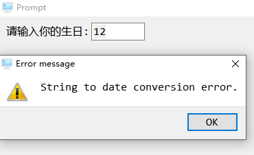

# 输入--键盘与鼠标的交互

之前的程序，我们都是在输出，输入的值，我们都是编写在程序中。

但这让程序每次输出的结果都一样，如果我们要其它结果就要重新编写代码。

为了解决上述问题，我们引入BDL语言可以支持的输入方式。

## Prompt--初次接触用户界面

请运行一下代码，查看输出情况，运行前请确保打开GDC客户端

```sql
define birth date
prompt "请输入你的生日:" for birth
display birth using "yyyy年mm月dd日"
```
是否出现了这个弹窗，如果未出现，请检查GDC安全性设置，调整为最低，且端口为6400。


随便输入一点东西试试看，报错了！`String to date conversion errr.`。
字符串转日期格式失败，它可以帮我自动转为日期格式！而且会检查是否正确！



我们尝试输入`19900101`或者`900101`。

现在查看控制台，成功转为了日期！
```sh
1990年01月01日
```

*代码分析*

`prompt "请输入你的生日:" for birth`
这一行为我们做了不少事情，我们来分析一下
+ 弹出一个新窗，且有一个可以输入的地方和确定取消按钮。
+ 可入处有输入说明。
+ 可输入的地方只能输入能转为日期的内容，否则无法确定并完成。
+ 将输入的内容转为`birth`变量的数据类型。

仅一行代码，就可以做这么多事情，这就是一开始说的BDL抽象级别比较高。
将大量的常使用功能集成到一起，不需要我们为重复的事情编写代码。


让我们试一试下面这些代码:
```sql
define birth date
define name varchar(6)
define sex varchar(1)
prompt "请输入你的生日:" for birth 
prompt "请输入你的姓名:" for name
prompt "你是男生吗y/n:" for sex
display sfmt("\n%1你好,你是否是男生(%2),你的生日是%3",name,sex,birth using "yy/mm/dd")
```

你会发现，prompt除了可以转换资料类型，还能够限制可以输入的字数。（一个中文汉字需要yi\\一个varchar(3)）

## 练习

1. 编写一个程序，首先输入一个日期a，然后输入一个整数b，计算a经过这个b天后的日期是哪一天。计算后将结果在控制台打印。

