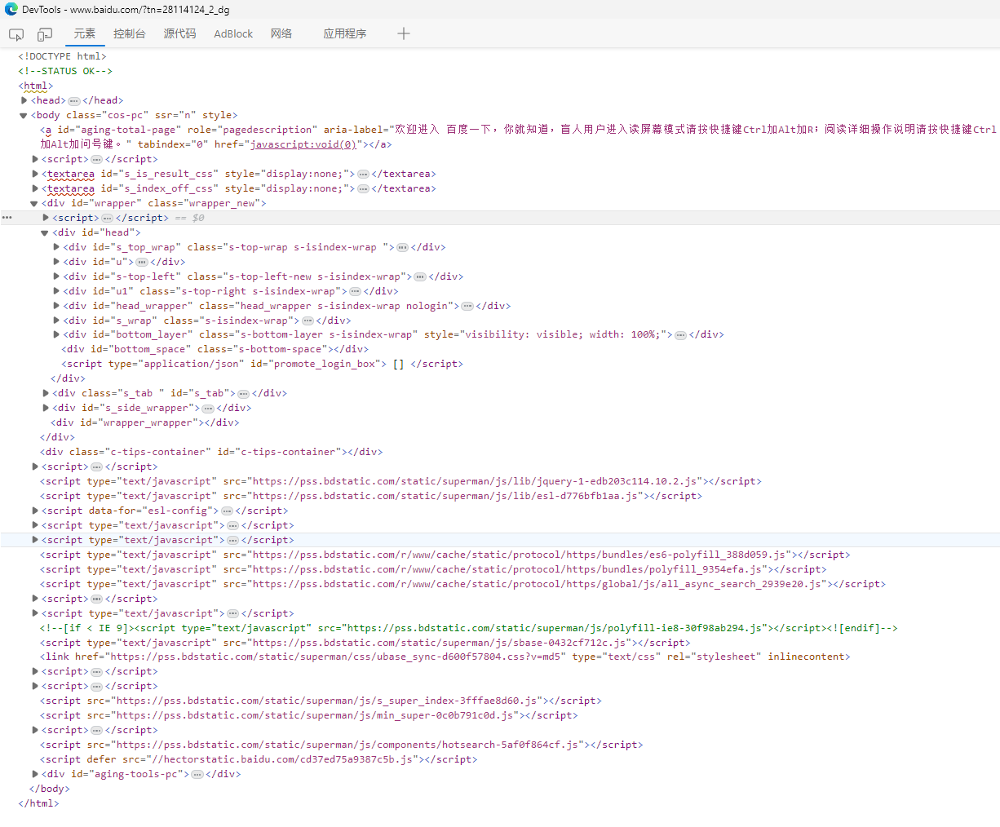

# 抽象界面

在编程领域中，GUI 界面如何描述一直是桌面程序开发中的一个难题。
在 BDL 中，我们使用 XML 来描述界面，BDL 操作界面作为补充。

`XML`是一种标记语言，它并不是编程语言。

你如果了解`HTML`，那么你就可以轻松理解`XML`。`XML`是一种要求严格的`HTML`，但他们实际并不存在包含不包含关系。

在[百度首页](https://baidu.com)，按下`F12`，你能看到如下界面，这就是`HTML`语言。`XML`也遵循着类似的结构风格。



## XML 语法

> XML 语法仅需要了解即可，并不会要求能够写出一个标准的 XML。只需要了解即可。

`XML`的语法非常简单，它由标签组成，标签分为开始标签和结束标签。

### 名词介绍

```xml
<?xml version="1.0" encoding="UTF-8"?>
<note name="n1" >
  <to>Tove</to>
  <from>Jani</from>
  <heading>Reminder</heading>
  <body>Don't forget me this weekend!</body>
</note>
```

以上 XML 代码中，

- `<?xml version="1.0" encoding="UTF-8"?>` 是 XML 的申明
- 任何一个 `<...>`到它的`<.../>`被称作元素，元素也被称为`节点`，是同一个意思

  - 以下是一个元素

  ```xml
      <note name="n1" >
      <to>Tove</to>
      <from>Jani</from>
      <heading>Reminder</heading>
      <body>Don't forget me this weekend!</body>
  </note>
  ```

  - 以下也是一个元素

  ```xml
  <to>Tove</to>
  ```

- 元素中可以包含元素
- `<to>Tove</to>`中`Tove`是元素`to`的值
- `<note name="n1" >`中`name="n1"`被称作属性，`name`是属性名，`n1`是属性值

### XML 文档必须有根元素

XML 必须包含根元素，它是所有其他元素的父元素，比如以下实例中 root 就是根元素：

```xml
<root>
  <child>
    <subchild>.....</subchild>
  </child>
</root>
```

以下实例中 note 是根元素：

```xml
<?xml version="1.0" encoding="UTF-8"?>
<note>
  <to>Tove</to>
  <from>Jani</from>
  <heading>Reminder</heading>
  <body>Don't forget me this weekend!</body>
</note>
```

### XML 声明

XML 声明文件的可选部分，如果存在需要放在文档的第一行，如下所示：

```xml
<?xml version="1.0" encoding="utf-8"?>
```

### 所有的 XML 元素都必须有一个关闭标签

在 XML 中，每一个`<...>`必须对应一个`<.../>`

```xml
<item>...</item>
```

### XML 必须正确嵌套

以下是正确语法：

```xml
<b>
    <i>This text is bold and italic</i>
</b>
```

以下语法是错误的：

```xml
<b>
    <i>This text is bold and italic</b>
</i>
```

### XML 属性值必须加引号

在 XML 中，XML 的属性值必须加引号。

请研究下面的两个 XML 文档。 第一个是错误的，第二个是正确的：

```xml
<note date=12/11/2007>
    <to>Tove</to>
    <from>Jani</from>
</note>
```

```xml
<note date="12/11/2007">
    <to>Tove</to>
    <from>Jani</from>
</note>
```

### 实体引用

在 XML 中，一些字符拥有特殊的意义。

如果您把字符 "<" 放在 XML 元素中，会发生错误，这是因为解析器会把它当作新元素的开始。

这样会产生 XML 错误：

```xml
<message>if salary < 1000 then</message>
```

为了避免这个错误，请用实体引用来代替 "<" 字符：

```xml
<message>if salary &lt; 1000 then</message>
```

| 原符号 | 需替换为 | 说明           |
| :----- | :------: | :------------- |
| `&lt;`   |    <     | 小于号      |
| `&gt;`   |    >     | 大于号   |
| `&amp;`  |    &     | and符      |
| `&apos;` |    '     | 单引号     |
| `&quot;` |    "     | 双引号 |

### XML 中的注释

```xml
<!-- This is a comment -->
```

### 验证XML是否合法

你可以在[xmlvalidation](https://www.xmlvalidation.com/)验证你的xml是否正确。


## BDL界面XML语法

`XML`语法很简单，但BDL中不是随便写一个`XML`语法就可以产生页面，页面上不同的输入框、按钮、表格等都需要特定的元素名称才可以实现，BDL才能正确识别。

我们先来看一下已有的文件的`XML`文件，在BDL中，我们调用的GUI文件是`42f`文件，`p_zz`主画面在`azz/42f/p_zz.42f`，让我们打开这个文件。

我们截取其中一部分文件：
```xml
<Page name="page01" text="Main">
    <Grid name="gr3040" width="72" height="2">
        <Label text="Program ID" posY="0" posX="1" gridWidth="10"/>
        <FormField name="zz_file.zz01" colName="zz01" sqlType="VARCHAR(20)" required="1" notNull="1" fieldId="0" sqlTabName="zz_file" tabIndex="1">
            <ButtonEdit width="18" action="controlp" image="zoom" shift="down" scroll="1" comment="KEY Field,No Blank/Repeated!" posY="0" posX="22" gridWidth="20"/>
        </FormField>
        <Label text="Module ID" posY="0" posX="48" gridWidth="9"/>
        <FormField name="zz_file.zz011" colName="zz011" sqlType="VARCHAR(10)" fieldId="1" sqlTabName="zz_file" tabIndex="2" notNull="1" required="1">
            <ComboBox width="7" queryEditable="1" comment="Which Module is the Program in. Fill it!" posY="0" posX="62" gridWidth="9"/>
        </FormField>
        <Label text="Program Name" posY="1" posX="1" gridWidth="12"/>
        <FormField name="gaz_file.gaz03" colName="gaz03" sqlType="VARCHAR(500)" fieldId="2" sqlTabName="gaz_file" tabIndex="3" noEntry="1">
            <Edit width="38" comment="Show Program Description" posY="1" posX="22" gridWidth="38"/>
        </FormField>
        <Button name="modify_program_name" width="5" text="Update" posY="1" posX="62" gridWidth="5" tabIndex="503"/>
    </Grid>
</Page>
<ComboBox width="18" queryEditable="1" posY="2" posX="27" gridWidth="20">
    <Item name="sm1" text="sm1"/>
    <Item name="sm2" text="sm2"/>
    <Item name="sm3" text="sm3"/>
    <Item name="popup" text="popup"/>
    <Item name="main" text="main"/>
    <Item name="dialog" text="dialog"/>
    <Item name="naked" text="naked"/>
    <Item name="viewer" text="viewer"/>
    <Item name="report" text="report"/>
    <Item name="err01" text="err01"/>
    <Item name="login" text="login"/>
    <Item name="view" text="view"/>
    <Item name="lib" text="lib"/>
</ComboBox>
```

可以看到上，元素的名称，属性都不是随便命名的：

+ 元素名称`FormField`、`Label`定义了这个元素显示的时候的基本类型，如标签、输入框等。
+ 元素的属性名`name`、`width`、`posY`、`posY` 分别指定了这个元素在页面上的显示位置，以及显示的类型。
+ 复杂的元素如下拉框`ComboBox`，除了本身之外，还有子元素`Item`

那么这么多的不同的名称都需要记住才能写好BDL的GUI界面吗，当然不需要！

安装GDC套件时，可选的`genero studio`既可以编写程序代码，也可以用鼠标拖拽的方式来生成BDL的GUI界面。

所以你只要知道每种元素的名称，就可以用鼠标来生成界面，然后直接产生画面档文件即可。
